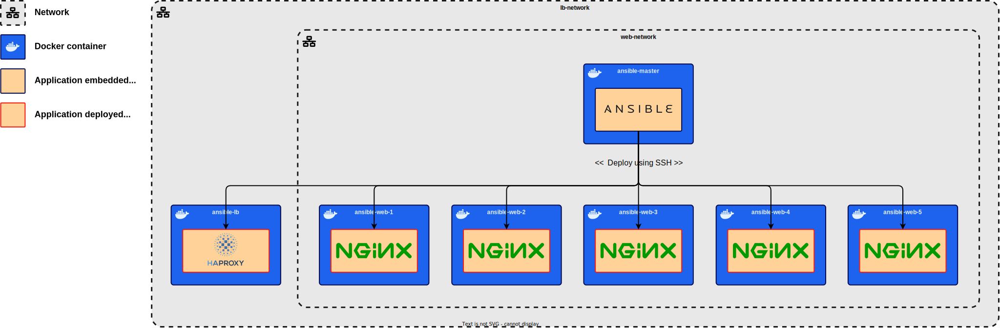

# Project 1 – Ansible-Driven Web Deployment

When I started using Ansible, I decided to create my own project without any documentation other than the official Ansible documentation. \
I think this is a good project for getting to grips with Ansible and understanding its fundamentals. \
I invite you to follow this first training project. 

?> Try to do it yourself and check the answer if you can't get it to work, or check to see if I have done the same thing (**if you haven't, that does not mean you are wrong, because I could be**).

## The goal

The primary goal of this project is to establish an architecture where Ansible will orchestrate the deployment of a load balancer (HAProxy) along with five NGINX web servers. This infrastructure will serve as a robust web hosting environment.   

- **Load balancer – `HAProxy`**: The load balancer will act as the user interface, directing incoming web requests to the available NGINX servers. It will play a crucial role in ensuring the even distribution of incoming traffic.

- **Web servers – `NGINX`**: There will be five NGINX web servers, **each configured identically**. These servers will host a standard `index.html` file with a unique server identifier. This server ID will allow us to identify and verify which specific server the load balancer has directed the user to. They will not be directyl accessible for the user as the network will not be acceblie.

In this architecture, the load balancer acts as a **central point of contact** for users and ensures that the incoming web requests are efficiently distributed among the NGINX servers. \
Importantly, these **NGINX servers will not be directly accessible for the user**, as the network will be isolated. They will operate solely to serve web content and respond to requests via the load balancer, effectively **creating a private and secure web hosting environment**.

This project will provide valuable insights into the setup and management of a load-balanced web hosting environment using Ansible.

Visual aids or images can be particularly helpful in further understanding this architecture.

    

        
Architecture created with <code>docker compose</code>

        
    

    

        
Deploying applications using <code>Ansible</code>

        
    

    

        
Use of architecture

        
    

 

---

## Part 1: Create the architecture

The initial step involves the establishment of an architecture comprising 7 distinct machines using `Docker`:
- **Ansible machine**: This machine serves as the control node for Ansible, responsible for orchestrating the configuration and management of the entire infrastructure.
- **HAProxy load balancer machine**: A dedicated machine for the HAProxy load balancer, which will intelligently distribute incoming web traffic to the NGINX servers for optimal load balancing.
- **NGINX servers**: There will be a total of <ins>5 NGINX server machines</ins>, each of which will host web content and collectively form the backend infrastructure. These servers are identical in configuration, ensuring consistency across the architecture.

The most convenient approach is to use `Docker Compose`, as we intend to create six replicas of identical empty machines – one for the HAProxy server and five for the NGINX servers.

### Emphasizing Learning Integrity

In the realm of Docker, the [`Docker Hub`][docker-hub] offers an extensive array of pre-configured images. It can be quite tempting to opt for Docker images that come pre-packaged with HAProxy or NGINX servers, but this goes against the core objective of the project, which is to gain a deep understanding of Ansible.

To uphold the educational value of this project and to ensure that you have the opportunity to learn how to use Ansible effectively, **only one container will contain an embedded application: the Ansible container**. The remaining containers will remain entirely empty, except for the essentials required for Ansible's operation, which include SSH and Python. It's through Ansible deployments that these containers will receive their applications, a crucial aspect of our hands-on learning experience.

This approach will allow us to focus on Ansible's capabilities and how it can be utilized to deploy applications within a complex architecture.

[docker-hub]: https://hub.docker.com/