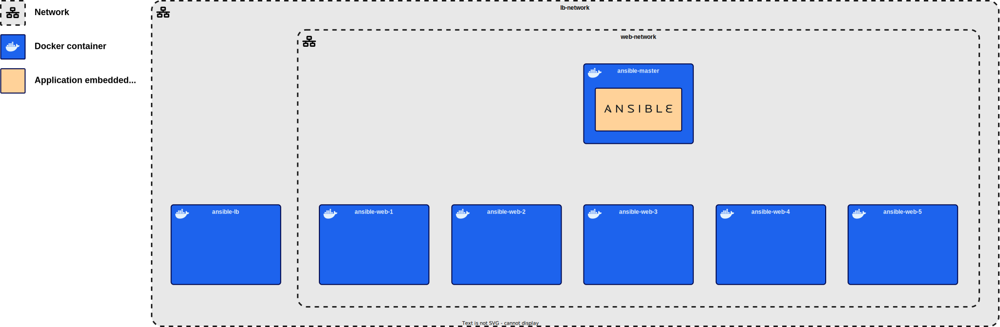

# Part 1 – Create the architecture

The initial step involves the establishment of an architecture comprising 7 distinct machines using `Docker`:
- **Ansible machine**: This machine serves as the control node for Ansible, responsible for orchestrating the configuration and management of the entire infrastructure.
- **HAProxy load balancer machine**: A dedicated machine for the HAProxy load balancer, which will intelligently distribute incoming web traffic to the NGINX servers for optimal load balancing.
- **NGINX servers**: There will be a total of <ins>5 NGINX server machines</ins>, each of which will host web content and collectively form the backend infrastructure. These servers are identical in configuration, ensuring consistency across the architecture.

The most convenient approach is to use `Docker Compose`, as we intend to create six replicas of identical empty machines – one for the HAProxy server and five for the NGINX servers.


## Emphasizing Learning Integrity

In the realm of Docker, the [`Docker Hub`][docker-hub] offers an extensive array of pre-configured images. It can be quite tempting to opt for Docker images that come pre-packaged with HAProxy or NGINX servers, but this goes against the core objective of the project, which is to gain a deep understanding of Ansible.

To uphold the educational value of this project and to ensure that you have the opportunity to learn how to use Ansible effectively, **only one container will contain an embedded application: the Ansible container**. The remaining containers will remain entirely empty, except for the essentials required for Ansible's operation, which include SSH and Python. It's through Ansible deployments that these containers will receive their applications, a crucial aspect of our hands-on learning experience.

This approach will allow us to focus on Ansible's capabilities and how it can be utilized to deploy applications within a complex architecture.


<br>


## Creating the Dockerfiles

As explained earlier, the objective is to create an architecture comprising one container with the integrated Ansible tool and six identical empty containers.

We will need to create two images for this purpose. As mentioned in the [Ansible introduction][ansible-introduction], **Ansible relies on SSH and Python** for its operation.
Therefore, we must create one image that includes Ansible, an SSH server, and Python, along with an image that contains only Python and an SSH client.

!> There is an underlying issue when using Ansible and Docker: **Docker does not include systemd**, which prevents us from utilizing [Ansible's `service` module][service-module]. \
To address this challenge, some users have created images that "emulate" systemd commands. For an image based on Ubuntu, we will use the following: [geerlingguy/docker-ubuntu2204-ansible][docker-image]. \
These images also contain Ansible. To use them, we'll make sure to remove Ansible from the Dockerfile for the load balancer and NGINX server containers.

<question-container question="Create the 2 Dockerfiles: one for the Ansible container and another as a standard template for the remaining containers.">

<!-- tabs:start -->
<!-- tab:Ansible's Dockerfile -->
The content of this `Dockerfile` is quite simple.\
We start with the [geerlingguy/docker-ubuntu2204-ansible][docker-image] image and add a set of testing tools, including `vim`, `net-tools`, `telnet`, and `curl`. \
Since containers have relatively short lifecycles, we will configure Ansible to connect using a password when establishing SSH connections to other containers. This is why we include the installation of `sshpass`.

Python is installed on the machine as `python3`. To make it accessible via the `python` command – which Ansible uses by default – we create a symbolic link in `/usr/bin/`. \
Note that instead of doing it manually here, we could have done it within the Ansible configuration.

!> Hereafter, we'll assume that the file is named `master.Dockerfile`.

```dockerfile
FROM geerlingguy/docker-ubuntu2204-ansible

RUN apt-get update && apt-get install -y vim net-tools telnet curl sshpass
RUN ln -s /usr/bin/python3 /usr/bin/python
```


<!-- tab:Dockerfile for the remaining containers -->
Previously mentioned, the requirement for access to systemd within the container leads us to use the [geerlingguy/docker-ubuntu2204-ansible][docker-image] image here. This image comes with Ansible pre-installed, which is why our initial step involves its removal.

Subsequently, we install various testing tools and configure the **'root' user with the password 'ansible'**. \
Below that, we establish SSH settings to enable password-based connections and resolve specific login issues.

!> Hereafter, we'll assume that the file is named `server.Dockerfile`.

```dockerfile
FROM geerlingguy/docker-ubuntu2204-ansible

# Uninstall Ansible via Pip.
RUN pip3 uninstall -y $pip_packages

RUN apt-get update
RUN apt-get install -y openssh-server vim net-tools telnet
RUN ln -s /usr/bin/python3 /usr/bin/python

RUN echo 'root:ansible' | chpasswd
RUN sed -i 's/#PermitRootLogin prohibit-password/PermitRootLogin yes/' /etc/ssh/sshd_config
RUN sed -i 's/PermitRootLogin prohibit-password/PermitRootLogin yes/' /etc/ssh/sshd_config
RUN sed -i 's/#PasswordAuthentication yes/PasswordAuthentication yes/' /etc/ssh/sshd_config


# SSH login fix. Otherwise user is kicked off after login
RUN sed 's@session\s*required\s*pam_loginuid.so@session optional pam_loginuid.so@g' -i /etc/pam.d/sshd

ENV NOTVISIBLE "in users profile"
RUN echo "export VISIBLE=now" >> /etc/profile

RUN mkdir -p /run/sshd
RUN mkdir ~/.ssh && chmod 700 ~/.ssh

CMD ["/usr/sbin/sshd", "-D"]
```
<!-- tabs:end -->

</question-container>


<br>


## Creating the `docker-compose.yml` file

Now that we have our Dockerfiles ready, it's time to build the complete architecture using Docker Compose. \
As a reminder, here is what the architecture should look like:




To create this architecture, let's break down the problem into three parts:


<!-- tabs:start -->
<!-- tab:Load balancer container -->
<table>
    <tr>
        <th>Image</th>
        <td>
            </p>
                We want the container to use the <code>Dockerfile</code> we created earlier : <code>server.Dockerfile</code>.
            </p>
        </td>
    </tr>
    <tr>
        <th>Network</th>
        <td>
            </p>
                We want to create a network named <code>lb</code>.
            </p>
        </td>
    </tr>
    <tr>
        <th>Ports</th>
        <td>
            <p>
                As the HAProxy application will be accessible to users, it's crucial that we link host ports to the containers.<br>
                Given that this server's role is to handle <strong>HTTP requests</strong>, we need to open the corresponding port.
            </p>
        </td>
    </tr>
    <tr>
        <th>Expose</th>
        <td>
            <p>
                In the <code>Ports</code> section above, you should have already defined the port corresponding to the HTTP protocol, so there is nothing further to do for this one. <br>
                As for the SSH port, you can specify it.
            </p>
        </td>
    </tr>
    <tr>
        <th>Volumes</th>
        <td>
            <p>
                As we are simulating a real architecture where remote access to the server is required, <strong>we won't use volumes</strong>.<br>
                Instead, we will <strong>deploy everything using Ansible</strong>.
            </p>
        </td>
    </tr>
</table>


<!-- tab:Web server containers -->
<table>
    <tr>
        <th>Image</th>
        <td>
            <p>
                We want the container to use the <code>Dockerfile</code> we created earlier : <code>server.Dockerfile</code>.
            </p>
        </td>
    </tr>
    <tr>
        <th>Network</th>
        <td>
            <p>
                We want to create a network named <code>web</code>, and it should also have access to the <code>lb</code> network to enable the load balancer's communication with the servers.
            </p>
        </td>
    </tr>
    <tr>
        <th>Ports</th>
        <td>
            <p>
                Since the <strong>NGINX servers will not be accessible by the user</strong>, but only by the other containers, there's no need to open ports for those containers.
            </p>
        </td>
    </tr>
    <tr>
        <th>Expose</th>
        <td>
            <p>
                In the <code>Ports</code> section above, <strong>there shouldn't have been any definitions</strong> because we don't intend for the host machine to access the servers. However, here, you can <strong>specify the port corresponding to the HTTP protocol</strong>. <br>
                As with the load balancer container, <strong>you can also define the SSH port</strong>.
            </p>
        </td>
    </tr>
    <tr>
        <th>Volumes</th>
        <td>
            <p>
                As we are simulating a real architecture where remote access to the servers is required, <strong>we won't use volumes</strong>. Instead, we will <strong>deploy everything using Ansible</strong>
            </p>
        </td>
    </tr>
    <tr>
        <th>Replicas</th>
        <td>
            <p>
                We aim to create identical containers five times.
            </p>
        </td>
    </tr>
</table>

<!-- tab:Ansible container -->
<table id="ansible-container-explanation">
    <tr>
        <th>Image</th>
        <td>
            <p>
                We want the container to use the docker file we created earlier : <code>master.Dockerfile</code>.
            </p>
        </td>
    </tr>
    <tr>
        <th>Network</th>
        <td>
            <p>
                In order to execute playbooks on remote servers, Ansible requires access to those machines. This is why the Ansible container must be part of both the <code>lb</code> and <code>web</code> networks.<br>
                By doing so, Ansible have access to the load balancer container and the five web server containers.
            </p>
        </td>
    </tr>
    <tr>
        <th>Ports</th>
        <td>
            <p>
                Since this container serves to standardize the Ansible installation to prevent potential issues on your machines, we will access this machine through <code>Docker Compose</code> and its <code>docker compose exec</code> command.<br>
                As a result, we won't access to the server other than through some 'tinkering', which means <strong>we don't need to open any ports<strong>.
            </p>
        </td>
    </tr>
    <tr>
        <th>Expose</th>
        <td>
            <p>
                In the <code>Ports</code> section above, you shouldn't have declared anything; it's in this part that you should specify the SSH port.
            </p>
        </td>
    </tr>
    <tr>
        <th>Volumes</th>
        <td>
            We will create 3 volumes to provide the container with Ansible configuration, playbooks and content for the other servers.
            <table id="ansible-volumes-table" class="equalize-columns">
                <tr>
                    <th>Host</th>
                    <th>Container</th>
                </tr>
                <tr>
                    <td>
                        <code>./master/config</code><br>
                        The folder that will contain all the Ansible configuration.
                    </td>
                    <td><code>/etc/ansible</code></td>
                </tr>
                <tr>
                    <td>
                        <code>./master/playbooks</code><br>
                        The folder that will contain all the Ansible playbooks.
                    </td>
                    <td><code>/root/playbooks</code></td>
                </tr>
                <tr>
                    <td>
                        <code>./slaves</code><br>
                        The folder that will contain all the 'slaves' content.
                    </td>
                    <td><code>/root/slaves</code></td>
                </tr>
            </table>
        </td>
    </tr>
</table>
<!-- tabs:end -->

?> As far as I know, exposing ports in Docker Compose is not mandatory but considered a good practice to follow.

<question-container question="Use the tables above to create the <code>docker-compose.yml</code> file.">

<!-- tabs:start -->
<!-- tab:Networks -->
As explain in the different tables, we have to create 2 networks for this infrastructure.
To prevent direct access to the web servers from the outside world, the 'web' network is configured as `bridge`.
Similarly, the 'lb' network is also created as `bridge`.

[To learn more about network drivers][docker-network-drivers]

<!-- TODO: Check whether 'lb' network should be 'bridge' or 'host' -->
```yml
networks:
    web:
        driver: bridge
    lb:
        driver: bridge
```

<!-- tab:Load balancer container -->
For the load balancer container, we use the `server.Dockerfile` created earlier.
To enable accessibility from the host, we are linking the port 80 of the container (default port for HTTP) to the port 8080 of the host machine. 

?> I have chosen port 8080 because there is another web server running on my PC using port 80. However, feel free to vary it according to your requirements.

In terms of networking, we integrate the container into the 'lb' network.

!> I have specified the `depends_on` setting here to ensure the web server containers are operational before creating this one, though it is not obligatory.
```yml
lb:
    build:
        context: .
        dockerfile: ./server.Dockerfile
    depends_on:
        - db
    ports:
        - 8080:80
    networks:
        - lb
```
<!-- tab:Web server containers -->
As mentioned earlier, we employ the same `server.Dockerfile` for both the web server and load balancer containers..
These web containers are connected to the 'web' and 'lb' networks.

The `deploy` settings enable the creation of multiple containers..
The value `replicas: 5`, specifies the desire for 5 identical containers.
The `restart_policy` setting is an optional configuration, explaining to Docker Compose the desired action when a container crashes.

```yml
web:
    build:
        context: .
        dockerfile: ./server.Dockerfile
    deploy:
        replicas: 5
        restart_policy:
            condition: on-failure
            max_attempts: 3
            window: 120s
    networks:
        - web
        - lb
```
<!-- tab:Ansible container -->
The 'master' container, as I refer to it, is created using the `master.Dockerfile` file.
It is connected to both the 'web' and 'lb' networks to interact with all containers using SSH.

In this case, I make Docker Compose wait until it creates the load balancer and web server containers before initializing the 'master' container. However, as with the HAProxy container configuration, it is optional.

I am sharing some folders of my PC to the container, enabling the passing of data such as Ansible configuration, Ansible playbooks, and content destined for deployment to other containers.

The `working_dir` setting allows me to specify in which folder the binaries will start. For instance, if you open a bash terminal and type `pwd`, you will get `/root/playbooks`.

Now, the `entrypoint` part determines what the container will do when started. With the current value, the container will send a command to `/bin/sh` which reads an infinite file, essentially a task that never ends.
I am using this to ensure the container doesn't stop after its creation, allowing us to instruct Ansible to deploy content to other containers.

```yml
master:
    build:
        context: .
        dockerfile: ./master.Dockerfile
    working_dir: /root/playbooks
    volumes:
        - ./master/playbooks:/root/playbooks
        - ./master/config:/etc/ansible
        - ./slaves:/root/slaves
    entrypoint:
        - /bin/sh
        - -c
        - tail -f /dev/null
    depends_on:
        - web
        - lb
    networks:
        - web
        - lb
```

<!-- tab:Full `docker-compose.yml` file -->
```yml
services:
    master:
        build:
            context: .
            dockerfile: ./master.Dockerfile
        working_dir: /root/playbooks
        volumes:
            - ./master/playbooks:/root/playbooks
            - ./master/config:/etc/ansible
            - ./slaves:/root/slaves
        entrypoint:
            - /bin/sh
            - -c
            - tail -f /dev/null
        depends_on:
            - web
            - lb
        networks:
            - web
            - lb

    lb:
        build:
            context: .
            dockerfile: ./server.Dockerfile
        depends_on:
            - web
        ports:
            - 8080:80
        networks:
            - lb

    web:
        build:
            context: .
            dockerfile: ./server.Dockerfile
        deploy:
            replicas: 5
            restart_policy:
                condition: on-failure
                max_attempts: 3
                window: 120s
        networks:
            - web
            - lb

networks:
    web:
        driver: bridge
    lb:
        driver: bridge
```
<!-- tabs:end -->

</question-container>


<br>


## Create file architecture

As specified in the [table containing explanation on how to create the Ansible container][ansible-container-explanation], we have to set up a well-structured file architecture. This ensures that the Ansible container has dedicated folders for its configuration and all the components it will deploy across various servers.

Refering to the [table][ansible-container-explanation], we have to create the following folders :
- `./master/config/`
- `./master/playbooks/`
- `./slaves/`

With these modifications, you should have a file architecture like this:
```treeview
./
|-- docker-compose.yml*
|-- master/
|   |-- config/
|   `-- playbooks/
|-- master.Dockerfile*
|-- server.Dockerfile*
`-- slaves/
```


<br>


## Run the architecture

The first part is complete, and the infrastructure is now prepared to handle the project. \
Technically, you still need to get it running using the command `docker compose -f docker-compose.yml up -d`. \
Once that done and the Docker Compose infrastructure up and running, let's continue.


[docker-hub]: https://hub.docker.com/
[ansible-introduction]: what-is-ansible/
[service-module]: https://docs.ansible.com/ansible/latest/collections/ansible/builtin/service_module.html
[docker-image]: https://hub.docker.com/r/geerlingguy/docker-ubuntu2204-ansible
[architecture-pt1]: _assets/media/ansible-training-pt1.svg
[docker-network-drivers]: https://docs.docker.com/network/drivers/
[ansible-container-explanation]: project-1/part-1?id=ansible-container-explanation