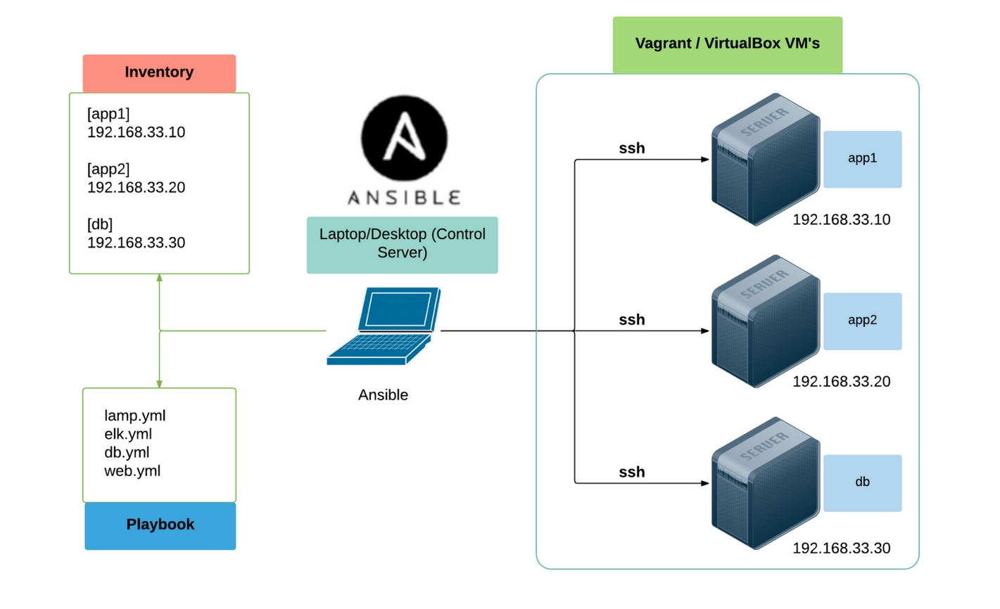

# Introducing Ansible

!> Please note that **the following content is not of my creation**. It is a translated version of [**the French course from Uptime Formation**][uptime-formation].

Ansible is a very popular **configuration manager**, **deployment and orchestration tool**, central to the world of **Infrastructure as Code** (IaC).
It is therefore also a central part of the **DevOps** movement, as it is a veritable Swiss army knife of infrastructure automation.

## History

Ansible was created in 2012 (more recently than its competitors Puppet and Chef) around a quest for simplicity and the principle of agentless configuration.

Highly linux/opensource oriented and versatile, it quickly enjoyed great success, proving to be a Swiss Army knife highly suited to DevOps and cloud automation in heterogeneous environments.

Red Hat acquired Ansible in 2015 and has developed a number of products around it (Ansible Tower, Ansible container with Openshift).

 

## Architecture: simplicity and portability with SSH and Python

!> Ansible is **agentless**, meaning it doesn't require any specific service/daemon on the machines to be configured.

Ansible's simplicity also stems from the fact that it is based on ubiquitous Linux technologies that have become universal.
- **SSH**: classic connection and authentication with accounts present on the machines.
- **Python** : cross-platform, a linux classic, suitable for sys admin and all uses.

In fact, Ansible runs smoothly on all Linux distributions, Debian, CentOs, Ubuntu in particular (and now also on Windows).

 

## Ansible for configuration

Ansible is **semi-declarative**, i.e. it runs **sequentially** but ideally **idempotently**.
It provides a descriptive state of the configuration:
- is **auditable**
- can **evolve gradually**
- **prevents it from drifting** into an unknown state

 

## Ansible for deployment and orchestration

Ansible can be used for **one-off** operations such as **deployment**:
- checking system dependencies and state requirements
- recovering a new version of source code
- database migration (if migration tool)
- operational testing (checking that a service is responding)

 

## Ansible at different scales

Ansible use cases range from ...:

- small:
    - ... a small playbook (≈ script) provided with software code to deploy in test mode.
    - ... the configuration of a personal work machine.
    - etc.
- medium:
    - ... make a lab with a few machines.
    - ... deploy an application with code, a runtime (PHP, Java,...) and a database to be migrated.
    - etc.
- large:
    - ... managing several DCs with multiple products.
    - ... multi-team management and logging of all operations using Ansible Tower.
    - etc.

 

## Ansible and Docker

Ansible is very complementary to docker:
- It lets you provision machines with docker or kubernetes installed and then deploy containers.
- It enables simple orchestration of containers with the `docker_container` module.

!> Maintenant un peu abandonné, `Ansible Container` rend possible de construire et déployer des conteneurs docker avec du code ansible. Concrètement le langage Ansible remplace le langage Dockerfile pour la construction des images Docker.

[uptime-formation]: https://supports.uptime-formation.fr/06-ansible/cours1/